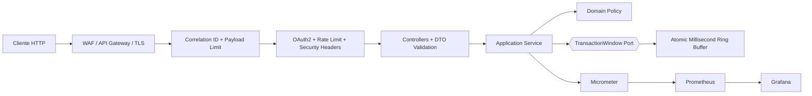
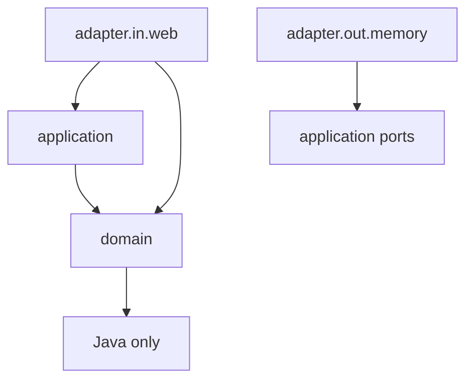

# Itaú Transaction Statistics API

[](https://github.com/YggorMartins/itau-teste/actions/workflows/ci.yml)
[](https://github.com/YggorMartins/itau-teste/actions/workflows/security.yml)


API REST de baixa latência para receber transações e calcular estatísticas de uma janela móvel de 60 segundos. O projeto evolui o desafio técnico do Itaú com arquitetura hexagonal, precisão monetária, concorrência sem lock global, observabilidade e controles AppSec.

> Projeto educacional de portfólio, sem vínculo oficial com o Itaú Unibanco. Os controles implementados apoiam segurança e privacidade, mas não constituem, isoladamente, certificação de conformidade com LGPD, BACEN ou normas internas de uma instituição financeira.

## Funcionalidades

- `POST /transacao`: valida e inclui uma transação.
- `DELETE /transacao`: limpa a janela em O(1) por troca de geração.
- `GET /estatistica`: devolve `count`, `sum`, `avg`, `min` e `max`.
- Janela configurável, com precisão temporal declarada de 1 ms.
- Cálculos internos com `BigDecimal`.
- Problem Details (`application/problem+json`) sem stacktrace ou detalhes internos.
- Rate limiting por subject autenticado ou IP, com bloqueio temporário e HTTP 429.
- Payload máximo de 10 KiB, inclusive para transferências chunked.
- OAuth2 Resource Server/JWT opcional, TLS 1.3 no profile de produção e logs JSON.

## Arquitetura





Estrutura principal:

```text
com.yggormartins.itauteste
├── domain          # entidades, estatísticas, regras e exceções
├── application     # caso de uso e porta de armazenamento
├── adapter/in/web  # REST, DTOs e Problem Details
├── adapter/out     # ring buffer concorrente
├── security        # payload limit, rate limit, identidade e correlação
└── config          # wiring, propriedades e Spring Security
```

## Por que um ring buffer?

A implementação original armazenava DTOs em um `ArrayList`, executava uma varredura O(N) em cada GET e concorria sem sincronização com POST, DELETE e scheduler.

`AtomicRingTransactionWindow` usa 60.001 slots para uma janela de 60 segundos:

- POST: O(1), atualização lock-free por compare-and-set.
- GET: O(B), em que B é fixo pela janela e não cresce com o volume de transações.
- DELETE: O(1), por incremento de uma geração lógica.
- Espaço: O(B), limitado e previsível.
- `count`, `sum`, `min` e `max` são publicados juntos em um bucket imutável.

`LongAdder` isolado não foi usado porque adders separados poderiam produzir uma combinação de count/sum/min/max que nunca existiu. O snapshot global é weakly consistent em relação a POSTs concorrentes, mas cada bucket observado é internamente coerente.

## Contrato HTTP

### Criar transação

```http
POST /transacao
Content-Type: application/json

{
  "valor": 123.45,
  "dataHora": "2026-08-20T12:00:00-03:00"
}
```

| Condição | Status |
|---|---:|
| `valor > 0` e `now-60s <= dataHora <= now` | 201 |
| JSON vazio, malformado, tipo inválido ou propriedade desconhecida | 400 |
| Campo ausente/nulo, valor não positivo, data futura ou expirada | 422 |
| Payload acima de 10 KiB | 413 |
| Limite de requisições excedido | 429 |

### Estatísticas

```http
GET /estatistica
```

```json
{
  "count": 3,
  "sum": 35.35,
  "avg": 11.783333333333333,
  "min": 5.05,
  "max": 20.2
}
```

Sem transações, todos os campos são zero.

### Limpar janela

```http
DELETE /transacao
```

Retorna HTTP 200 sem corpo.

## Execução

### IntelliJ IDEA

1. Abra a pasta que contém `pom.xml`.
2. Selecione JDK 21.
3. Reimporte o projeto Maven.
4. Execute `ItauTesteApplication`.

### Maven Wrapper

```bash
./mvnw verify
./mvnw spring-boot:run
```

No Windows:

```powershell
.\mvnw.cmd verify
.\mvnw.cmd spring-boot:run
```

### Docker hardened

```bash
docker compose up --build
```

A API fica disponível somente em `127.0.0.1:8080`. O container executa como UID 65532, sem capabilities, com `no-new-privileges`, root filesystem somente leitura, limites de memória/CPU/PIDs e runtime Distroless sem shell.

Observabilidade local:

```bash
GRAFANA_ADMIN_PASSWORD='use-um-segredo-local' \
  docker compose --profile observability up --build
```

- API: `http://127.0.0.1:8080`
- Prometheus: `http://127.0.0.1:9090`
- Grafana: `http://127.0.0.1:3000`

## Segurança

### Rate limiting e DoS

Configuração padrão:

```yaml
app:
  security:
    max-payload-bytes: 10240
    rate-limit:
      capacity: 100
      refill-tokens: 100
      refill-period: 1s
      temporary-block: 10s
      maximum-tracked-clients: 100000
```

- Bucket4j fornece token bucket thread-safe.
- Caffeine limita o número de clientes rastreados, impedindo que o próprio cache seja usado para exaustão de memória.
- Um principal OAuth2 autenticado é identificado pelo hash SHA-256 do subject; demais clientes usam o endereço remoto.
- `X-Forwarded-For` e `X-API-Key` arbitrários não são aceitos como identidade.
- `Retry-After`, `X-RateLimit-Limit` e `X-RateLimit-Remaining` são devolvidos ao cliente.
- Health probes não são bloqueadas pelo limiter.

O limiter é local à JVM. DDoS volumétrico deve ser bloqueado antes da aplicação por CDN/WAF/API Gateway, com quota distribuída em Redis ou no próprio gateway. Em um deployment atrás de proxy, aceite forwarded headers apenas dos proxies confiáveis.

### Validação e desserialização

- DTO imutável.
- Campos obrigatórios e escala monetária limitada a 15 inteiros e 2 decimais.
- Propriedades desconhecidas e tokens JSON posteriores são rejeitados.
- Corpo é lido de forma limitada antes do Jackson, inclusive sem `Content-Length`.
- Não existem interpretadores SQL, NoSQL, shell, template HTML ou comandos baseados no payload.

### Security headers

Spring Security envia:

- `Content-Security-Policy: default-src 'none'; frame-ancestors 'none'; ...`
- `X-Content-Type-Options: nosniff`
- `X-Frame-Options: DENY`
- `Referrer-Policy: no-referrer`
- políticas de no-cache para respostas sensíveis
- HSTS por 365 dias, com subdomínios e preload, somente em HTTPS

O header `Server` é configurado como vazio. A borda também deve remover headers de produto/versão.

### OAuth2/JWT

O modo compatível com o desafio é público. Para habilitar o Resource Server:

```bash
SPRING_PROFILES_ACTIVE=oauth2 \
OAUTH2_ISSUER_URI=https://idp.example.com/issuer \
OAUTH2_AUDIENCE=itau-teste-api \
./mvnw spring-boot:run
```

Escopos:

| Operação | Authority |
|---|---|
| POST `/transacao` | `SCOPE_transactions.write` |
| DELETE `/transacao` | `SCOPE_transactions.delete` |
| GET `/estatistica` | `SCOPE_statistics.read` |
| GET `/actuator/prometheus` | `SCOPE_metrics.read` |

O decoder confia somente em RS256 configurado, valida issuer e audience e não aceita JWT `alg=none`. Chaves privadas pertencem ao Identity Provider/KMS e nunca a este repositório.

### TLS 1.3

Em produção, prefira terminação TLS 1.3/mTLS no load balancer ou service mesh. Para terminação direta na JVM, ative `prod,oauth2` e forneça um PKCS#12 por secret mount:

```text
SPRING_PROFILES_ACTIVE=prod,oauth2
TLS_KEYSTORE_PATH=/run/secrets/api-keystore.p12
TLS_KEYSTORE_PASSWORD=<secret manager>
OAUTH2_ISSUER_URI=https://idp.example.com/issuer
```

Não coloque certificados, keystores ou senhas em imagem, Compose, Git ou variáveis persistidas em arquivos.

### Logs e proteção de dados

- Logs estruturados Logstash JSON em stdout.
- Correlation ID validado, com máximo de 64 caracteres.
- Request bodies, valores financeiros, tokens, API keys e headers de autorização não são registrados.
- Erros 500 registram apenas tipo da exceção e correlation ID.
- Stacktrace, binding details e mensagens internas nunca aparecem na resposta.
- Correlation ID não vira tag Prometheus, evitando alta cardinalidade.

Para produção, defina retenção, criptografia, RBAC e trilha de auditoria na plataforma de logs. Logs operacionais não devem ser usados como ledger financeiro.

### OWASP API Security Top 10

| Risco | Controle neste projeto |
|---|---|
| Broken Object/Function Authorization | Escopos por endpoint; deny-by-default no modo OAuth2 |
| Broken Authentication | Resource Server, issuer/audience e RS256 |
| Unrestricted Resource Consumption | rate limit, limite de payload, timeouts e quotas de container |
| Sensitive Business Flow Abuse | quota por subject/IP e 429 temporário |
| Security Misconfiguration | headers, actuator mínimo, no error leakage, container non-root |
| Improper Inventory | endpoints e profiles documentados; CI/Dependabot |
| Unsafe Dependencies | Trivy, dependency review e atualização semanal |

## Observabilidade

- `/actuator/health/liveness`
- `/actuator/health/readiness`
- `/actuator/prometheus`
- métricas JVM/Tomcat e `http.rate_limit.requests{result}`
- logs JSON com `correlationId`

Somente `health`, `info` e `prometheus` são expostos. Endpoints como `env`, `configprops`, `heapdump` e `loggers` permanecem desabilitados.

## Testes e quality gates

- JUnit 5 e AssertJ.
- Casos de borda monetários e temporais com `Clock.fixed`.
- 10 mil writers concorrentes no mesmo bucket.
- Testes HTTP E2E com MockMvc.
- Testes de rate limit, payload, correlation ID e headers.
- ArchUnit impedindo dependências de framework no domínio.
- JaCoCo com gate mínimo de 80% de linhas.

```bash
./mvnw verify
```

Antes de anunciar throughput, execute JMH e um teste HTTP com k6/Gatling e publique p50/p95/p99, CPU, heap, JDK, máquina e commit. “10k ops/s” é meta, não resultado medido neste repositório.

## DevSecOps

O workflow `security.yml` executa:

- CodeQL SAST com queries `security-extended`.
- Trivy SCA, secret scan, IaC scan e container scan.
- Gitleaks no histórico completo.
- GitHub Dependency Review em pull requests.
- OWASP ZAP baseline DAST contra um container isolado.
- Dependabot para Maven, Actions e Docker.

Em ambientes regulados, fixe Actions e imagens por digest/SHA, exija revisão do CODEOWNERS para alterações em `.github`, `Dockerfile` e segurança, e assine imagens com identidade keyless (Sigstore/Cosign).

## Limitações e evolução distribuída

- Estado em memória não é durável e é perdido no restart, conforme o desafio.
- Cada réplica teria sua própria estatística. Escala horizontal exige um adapter compartilhado.
- Opção futura: buckets Redis atualizados atomicamente por Lua, com TTL, armazenando dinheiro em unidade inteira quando a escala for fixa.
- Para auditoria/replay, use um log durável e agregação por Kafka Streams/Flink.
- Não introduza Redis/Kafka sem benchmark e requisito operacional que justifiquem o custo.

## Referências

- [OWASP API4:2023 — Unrestricted Resource Consumption](https://owasp.org/API-Security/editions/2023/en/0xa4-unrestricted-resource-consumption/)
- [OWASP REST Security Cheat Sheet](https://cheatsheetseries.owasp.org/cheatsheets/REST_Security_Cheat_Sheet.html)
- [Spring Security — HTTP Security Headers](https://docs.spring.io/spring-security/reference/features/exploits/headers.html)
- [Spring Security — OAuth2 Resource Server JWT](https://docs.spring.io/spring-security/reference/servlet/oauth2/resource-server/jwt.html)
- [Spring Boot — Metrics](https://docs.spring.io/spring-boot/reference/actuator/metrics.html)
- [Docker Engine Security](https://docs.docker.com/engine/security/)

## Licença

Nenhuma licença foi definida ainda. Adicione uma licença somente após decisão explícita do proprietário do repositório.
